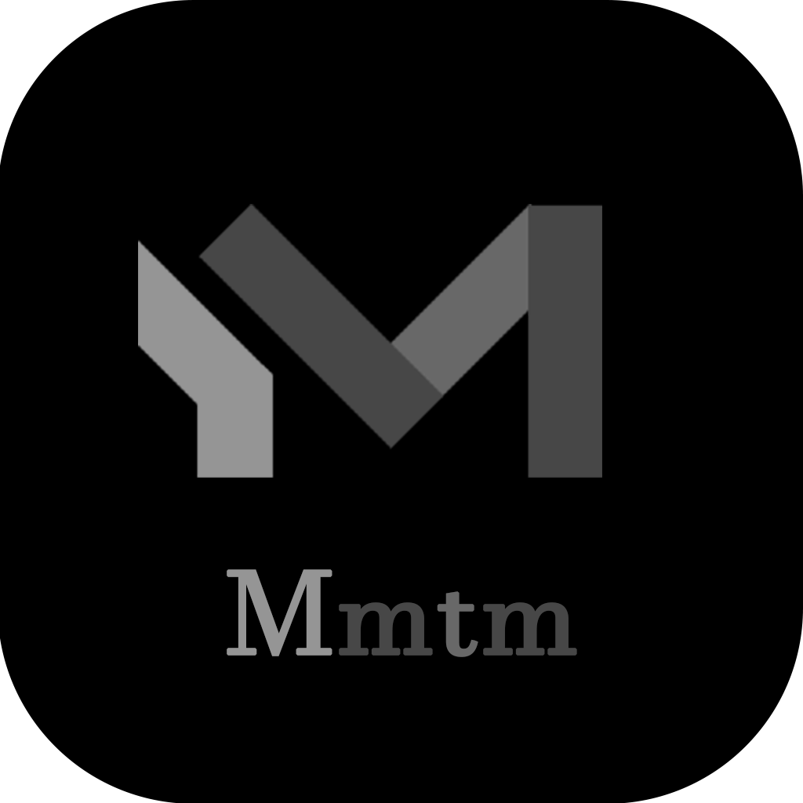

# 📖 일기장 PWA - 완전 구현 버전

**IndexedDB + 이미지 압축 + Google Drive 백업/복원** 을 모두 갖춘 React 기반 일기 앱입니다.



## ✨ 주요 기능

### 🎯 완전히 구현된 기능들

- ✅ **React + Vite** 기반 모던 웹 앱
- ✅ **IndexedDB (Dexie)** 로컬 데이터 저장
  - 텍스트와 이미지를 별도 테이블로 분리 관리
  - Blob 형식으로 이미지 저장
- ✅ **HTML5 Canvas 이미지 압축**
  - 자동 리사이징 (최대 1920px)
  - WebP/JPEG 압축 (품질 85%)
  - 썸네일 자동 생성
- ✅ **Swiper.js 이미지 캐러셀**
  - Fade 전환 효과
  - Navigation 버튼
  - Loop false 설정
- ✅ **react-day-picker 캘린더**
  - 한국어 UI
  - 일기 있는 날짜 표시
  - YYYY-MM-DD 포맷
- ✅ **Google Drive 동기화**
  - OAuth 2.0 인증
  - 전체 백업 (이미지 포함)
  - 복원 기능
  - 진행률 표시
- ✅ **PWA 오프라인 지원**
  - Service Worker
  - 캐시 전략
  - 설치 가능
- ✅ **반응형 디자인**
  - 모바일 최적화
  - 사이드바 토글
- ✅ **Toast 알림 시스템**

---

## 🚀 빠른 시작

### 1. 설치

```bash
cd f:/LAB/DIARY2
npm install
```

### 2. 실행

```bash
npm run dev
```

브라우저에서 `http://localhost:5173` 접속

### 3. 빌드

```bash
npm run build
npm run preview
```

---

## ⚙️ Google Drive 설정 (선택사항)

백업/복원 기능을 사용하려면 Google Drive API 설정이 필요합니다.

### 1단계: Google Cloud Console 설정

1. [Google Cloud Console](https://console.cloud.google.com) 접속
2. 새 프로젝트 생성
3. **API 및 서비스** → **라이브러리** 
4. **Google Drive API** 검색 및 사용 설정
5. **사용자 인증 정보** → **사용자 인증 정보 만들기**
6. **OAuth 2.0 클라이언트 ID** 선택
7. 애플리케이션 유형: **웹 애플리케이션**
8. **승인된 JavaScript 원본** 추가:
   - `http://localhost:5173`
   - `http://localhost:4173`
   - (프로덕션 도메인)

### 2단계: API 키 설정

`src/services/googleDrive.js` 파일을 열고 다음 값을 교체:

```javascript
const CLIENT_ID = 'YOUR_GOOGLE_CLIENT_ID.apps.googleusercontent.com';
const API_KEY = 'YOUR_GOOGLE_API_KEY';
```

### 3단계: 사용

1. 앱 하단 우측의 **🔄 백업 및 동기화** 버튼 클릭
2. **Google 로그인** 버튼 클릭
3. Google 계정 인증
4. **지금 백업하기** 클릭

---

## 📖 사용 방법

### 일기 작성

1. 좌측 캘린더에서 날짜 선택
2. 우측 하단 **✏️ 편집** 버튼 클릭
3. 제목, 내용, 태그 입력
4. **📷 이미지 선택** 버튼으로 사진 추가
5. **💾 저장** 클릭

### 이미지 관리

- **추가**: 편집 모드에서 이미지 선택 버튼 클릭
- **삭제**: 이미지 썸네일의 × 버튼 클릭
- **보기**: 상단 이미지 캐러셀에서 좌우 버튼으로 탐색

### 백업 및 복원

#### Google Drive 백업
1. 우측 하단 **🔄 백업 및 동기화** 버튼
2. Google 로그인
3. **📤 지금 백업하기** 클릭
4. 진행률 확인 후 완료

#### Google Drive 복원
1. 백업 파일 목록에서 복원할 파일 선택
2. **복원** 버튼 클릭
3. 확인 후 자동 새로고침

#### 수동 백업 (JSON)
- **내보내기**: 💾 수동 백업 → 📥 JSON 내보내기
- **가져오기**: 💾 수동 백업 → 📤 JSON 가져오기

---

## 🗂️ 프로젝트 구조

```
f:/LAB/DIARY2/
├── public/
│   ├── icon-192x192.png      # PWA 아이콘
│   └── icon-512x512.png      # PWA 아이콘
├── src/
│   ├── components/
│   │   ├── Calendar.jsx      # 캘린더 (react-day-picker)
│   │   ├── Calendar.css
│   │   ├── ImageCarousel.jsx # 이미지 슬라이더 (Swiper)
│   │   ├── ImageCarousel.css
│   │   ├── EntryEditor.jsx   # 일기 편집기
│   │   ├── EntryEditor.css
│   │   ├── BackupPanel.jsx   # 백업 패널
│   │   ├── BackupPanel.css
│   │   ├── Layout.jsx        # 레이아웃
│   │   ├── Layout.css
│   │   ├── Toast.jsx         # 알림
│   │   └── Toast.css
│   ├── db/
│   │   ├── db.js            # Dexie 스키마
│   │   └── adapter.js       # DB CRUD + Blob 관리
│   ├── services/
│   │   └── googleDrive.js   # Google Drive API
│   ├── utils/
│   │   └── imageCompression.js  # Canvas 이미지 압축
│   ├── App.jsx              # 메인 앱
│   ├── App.css
│   ├── main.jsx             # 엔트리 포인트
│   └── index.css
├── package.json
├── vite.config.js           # PWA 플러그인 설정
└── README.md
```

---

## 🎨 기술 스택

### Frontend
- **React 19**: UI 라이브러리
- **Vite**: 빌드 도구
- **Swiper 12**: 이미지 캐러셀
- **react-day-picker 9**: 캘린더
- **date-fns**: 날짜 처리

### Storage & Data
- **Dexie.js**: IndexedDB 래퍼
- **HTML5 Canvas**: 이미지 압축

### PWA & Sync
- **vite-plugin-pwa**: PWA 자동 설정
- **Google Drive API**: 클라우드 백업

### Styling
- **Vanilla CSS**: 완전한 커스터마이징

---

## 💾 데이터 구조

### Entry (일기 엔트리)
```javascript
{
  date: '2025-12-02',        // Primary Key (YYYY-MM-DD)
  title: '제목',
  content: '내용...',
  tags: ['태그1', '태그2']
}
```

### Image (이미지)
```javascript
{
  id: 1,                     // Auto Increment
  entryDate: '2025-12-02',   // 연결된 일기 날짜
  blob: Blob,                // 압축된 이미지 Blob
  thumbnail: Blob,           // 썸네일 Blob (200x200)
  createdAt: Date            // 생성 일시
}
```

---

## 🔧 고급 기능

### 이미지 압축 옵션

`src/utils/imageCompression.js`에서 설정 가능:

```javascript
const blob = await compressImage(file, {
  maxWidth: 1920,      // 최대 폭 (px)
  maxHeight: 1920,     // 최대 높이 (px)
  quality: 0.85,       // 압축 품질 (0-1)
  format: 'webp'       // 'webp' 또는 'jpeg'
});
```

### 스토리지 관리

브라우저 DevTools에서 확인:
1. **F12** → **Application** 탭
2. **IndexedDB** → **DiaryDB**
3. **entries**, **images** 테이블 확인

IndexedDB 사용량 조회:
```javascript
import { getStorageUsage } from './db/adapter';

const usage = await getStorageUsage();
console.log(usage);
// { entries: 1234, images: 5678900, total: 5680134 }
```

---

## 📱 PWA 설치

### 데스크톱 (Chrome)
1. 주소창 우측 **설치** 아이콘 클릭
2. 또는 메뉴 → **앱 설치**

### 모바일 (Android/iOS)
1. 브라우저 메뉴 열기
2. **홈 화면에 추가**
3. 아이콘이 생성되어 네이티브 앱처럼 실행

---

## 🐛 문제 해결

### 이미지가 표시되지 않음
- 브라우저 IndexedDB 확인
- Object URL 생성 확인
- 콘솔 에러 확인

### Google Drive 로그인 실패
- CLIENT_ID, API_KEY 재확인
- 승인된 JavaScript 원본에 현재 주소 추가
- OAuth 동의 화면 설정 확인

### PWA가 설치되지 않음
- HTTPS 또는 localhost에서만 가능
- manifest.json 생성 확인
- Service Worker 등록 확인

### 데이터가 사라짐
- IndexedDB는 브라우저 데이터 삭제 시 함께 삭제됨
- 정기적으로 Google Drive 백업 또는 JSON 내보내기 권장

---

## 🔐 보안 및 개인정보

- **모든 데이터는 로컬에 저장**: 서버 없음
- **Google Drive 백업**: 사용자 Google 계정에만 저장
- **OAuth 2.0**: 안전한 인증
- **오프라인 사용 가능**: 인터넷 없이도 작동

---

## 📄 라이선스

MIT License - 자유롭게 사용, 수정, 배포 가능

---

## 💡 개발 팁

### 개발 모드 실행
```bash
npm run dev
```

### 프로덕션 빌드
```bash
npm run build
npm run preview
```

### 로그 확인
- **Ctrl + Shift + I** (DevTools)
- Console 탭에서 에러 확인

---

## 🎯 다음 단계 (선택사항)

- [ ] 검색 기능 추가
- [ ] 태그 필터링
- [ ] 다크 모드
- [ ] 마크다운 지원
- [ ] 음성 녹음
- [ ] 위치 정보 (GeoLocation)
- [ ] 월별/연도별 통계

---

## 👨‍💻 개발 정보

- **프레임워크**: React 19 + Vite
- **개발 기간**: 2025-12-02
- **버전**: 1.0.0

**즐거운 일기 작성 되세요! 📝✨**
